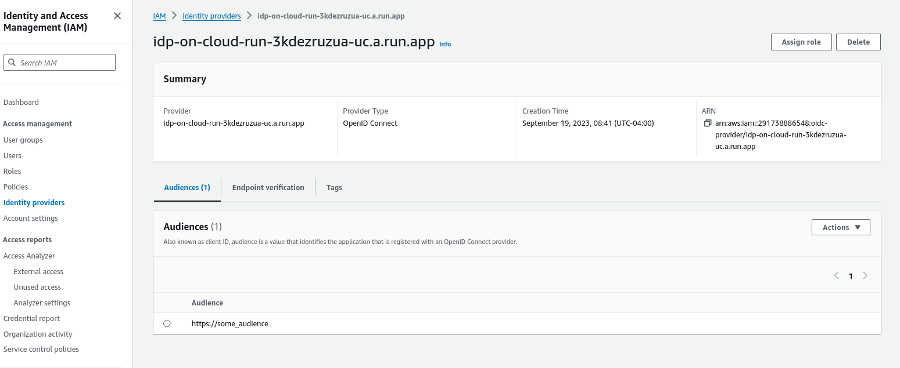
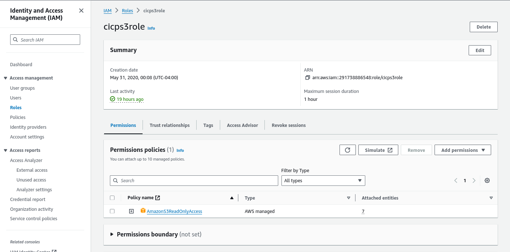
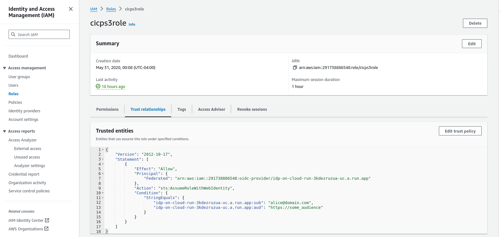
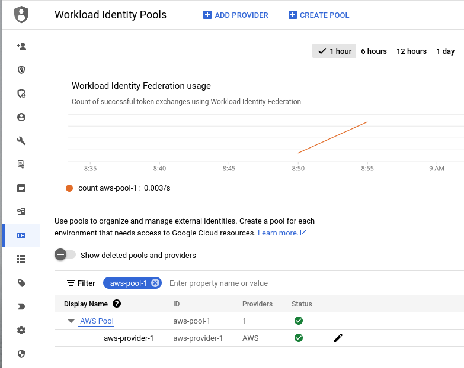
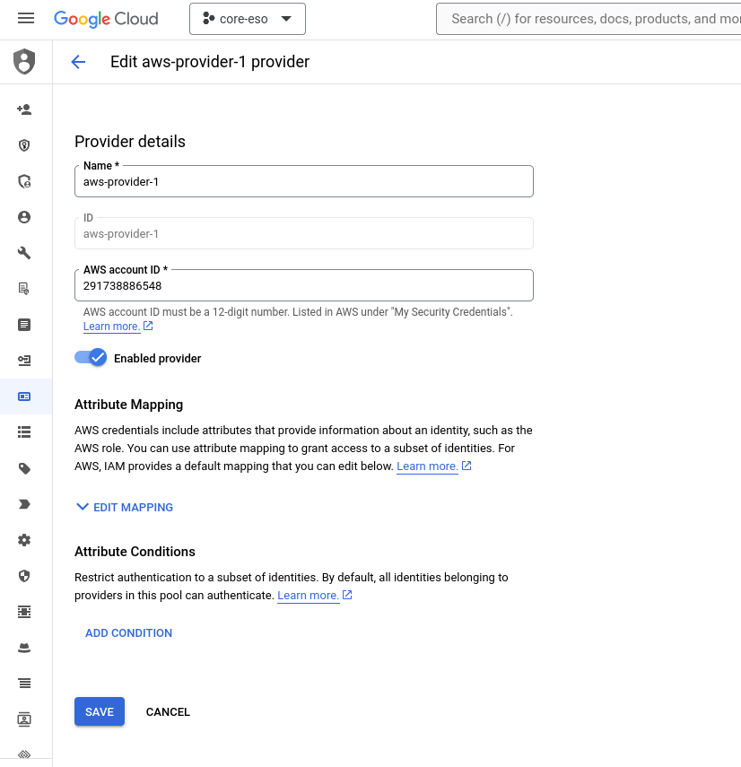
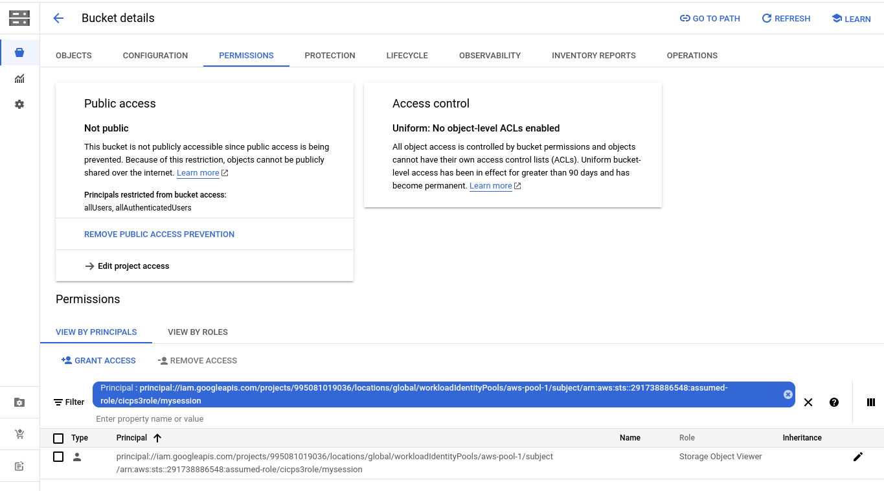

### GCP Authentication from AWS with AWS_WEB_IDENTITY_TOKEN_FILE

Language samples which allows AWS credentials sourced from `AWS_WEB_IDENTITY_TOKEN_FILE`  to access GCP resources.

For example, this allows for workload federation to use volume projection on AWS to access GCP resources.

ref:

* [Workload Identity Federation not using AWS EKS Service Account Token Volume Projection](https://issuetracker.google.com/issues/238911014)

This repo contains samples covering

* [java](https://github.com/googleapis/google-auth-library-java?tab=readme-ov-file#using-a-custom-supplier-with-aws)
* [Go](https://pkg.go.dev/golang.org/x/oauth2@v0.20.0/google/externalaccount#AwsSecurityCredentialsSupplier)
* [Python](https://googleapis.dev/python/google-auth/latest/user-guide.html#accessing-resources-using-a-custom-supplier-with-aws)
* [Nodejs](https://github.com/googleapis/google-auth-library-nodejs?tab=readme-ov-file#accessing-resources-from-aws-using-a-custom-aws-security-credentials-supplier)
* `gcloud`

---

### References

* [GCP Workload Identity Federation using AWS Credentials](https://github.com/salrashid123/gcpcompat-aws)
* [Using Kubernetes Service Accounts for Google Workload Identity Federation](https://github.com/salrashid123/k8s_federation_with_gcp)
* [Simple GCP OIDC workload Federation using a fake oidc server](https://gist.github.com/salrashid123/677866e42cf2785fe885ae9d6130fc21)
* [DIY OIDC Server](https://github.com/salrashid123/diy_oidc)
* [Process Credentials for GCP Client Library](https://github.com/salrashid123/gcp_process_credentials_go?tab=readme-ov-file#implementations)
* [Exchange Google and Firebase OIDC tokens for AWS STS](https://github.com/salrashid123/awscompat)
* [Security Token Service (STS) Credentials for HTTP and gRPC (rfc8693)](https://github.com/salrashid123/sts)

---

### Setup

This repo contains samples but to use them you need to configure AWS and GCP for workload federation.

On the AWS side, this repo configures uses a sample *TEST* OIDC service to locally.  This just allows authentication *TO* AWS.  The AWS credentials then accessed through `AWS_WEB_IDENTITY_TOKEN_FILE`.  Normally all this is done if you're on EKS/ECS.

This step simulates what EKS does (eg, saves the creds on a volume projection).

Once the creds a visible, the samples here exchanges the aws credentials for GCP ones:

The full flow is:

* aws: configure federation with fake oidc server
* user: get get oidc token
* user: exchange oidc token for aws credentials
* save credentials to `AWS_WEB_IDENTITY_TOKEN_FILE`
* gcp: configure aws workload federation
* user: use gcp library to exchange aws token for gcp credential
* user: access gcp resource

#### OIDC Server

As mentioned, we'll just setup a _fake_ oidc server which allows AWS authentication. 

**WARNING**:  this is just a test public oidc server..you should setup a variation of the diy oidc server with your own private key if you want to us the just as a test...

Anyway, using the defaults, you can get an oidc token pretty easily

```bash
git clone https://github.com/salrashid123/diy_oidc
cd diy_oidc

export URL="https://idp-on-cloud-run-3kdezruzua-uc.a.run.app"
export IAT=`date -u +%s`
export EXP=`date -u +%s -d "+3600 seconds"`
export EMAIL="alice@domain.com"
export SUB="alice@domain.com"
export ISS=$URL
export NAME="alice"
export AUD="https://some_audience"
envsubst < "templates/jwt.tmpl" > "/tmp/jwt.json"
export JWT_TOKEN=`curl -s -X POST -d @/tmp/jwt.json  $URL/token?kid=rsaKeyID_1`
echo -n $JWT_TOKEN > /tmp/aws.txt
```

the JWT token is saved to `/tmp/aws.txt` which is accessed by the AWS SDK via `AWS_WEB_IDENTITY_TOKEN_FILE`

### AWS Role

On the AWS side, configure an 


- identity provider:



Then configure a role and permissions:

- Permissions:




- Role:



Note the trust relationship allows for an oidc token issued by the service

Ofcourse your ARN values and role name will be different!

```json
{
    "Version": "2012-10-17",
    "Statement": [
        {
            "Effect": "Allow",
            "Principal": {
                "Federated": "arn:aws:iam::291738886548:oidc-provider/idp-on-cloud-run-3kdezruzua-uc.a.run.app"
            },
            "Action": [
                "sts:AssumeRoleWithWebIdentity"
            ],
            "Condition": {
                "StringEquals": {
                    "idp-on-cloud-run-3kdezruzua-uc.a.run.app:aud": "https://some_audience",
                    "idp-on-cloud-run-3kdezruzua-uc.a.run.app:sub": "alice@domain.com"
                }
            }
        }
    ]
}
```

From there, test if the baseline setup works (again, replace with your own ARN and role)

```bash
export AWS_WEB_IDENTITY_TOKEN_FILE=/tmp/aws.txt
export AWS_ROLE_ARN="arn:aws:iam::291738886548:role/cicps3role"
export AWS_ROLE_SESSION_NAME=mysession

$ aws s3  ls s3://

$ aws sts assume-role-with-web-identity \
 --role-arn $AWS_ROLE_ARN \
 --role-session-name $AWS_ROLE_SESSION_NAME \
 --web-identity-token file:///$AWS_WEB_IDENTITY_TOKEN_FILE \
 --duration-seconds 1000 
```

#### GCP Federation

Now setup the GCP side of the house

Here we are just setting up a basic AWS federation, thats all.  

To do this, i'm more or less following:

* [GCP Workload Identity Federation using AWS Credentials](https://github.com/salrashid123/gcpcompat-aws)

- Pool



- Provider



Then configure a bucket IAM binding



eg:

```bash
export PROJECT_ID=`gcloud config get-value core/project`
export PROJECT_NUMBER=`gcloud projects describe $PROJECT_ID --format='value(projectNumber)'`

gcloud storage buckets create gs://$PROJECT_ID-bucket

## for me the gcp mapped principal was:
## principal://iam.googleapis.com/projects/995081019036/locations/global/workloadIdentityPools/aws-pool-1/subject/arn:aws:sts::291738886548:assumed-role/cicps3role/mysession 

gcloud storage buckets add-iam-policy-binding  gs://$PROJECT_ID-bucket \
   --member="principal://iam.googleapis.com/projects/995081019036/locations/global/workloadIdentityPools/aws-pool-1/subject/arn:aws:sts::291738886548:assumed-role/cicps3role/mysession" \
    --role="roles/storage.objectViewer"
```

---

For implementations below, remember to set the env var and edit the source to specify the audience and bucket to iterate


### go

* [AwsSecurityCredentialsSupplier](https://pkg.go.dev/golang.org/x/oauth2/google/externalaccount#AwsSecurityCredentialsSupplier)

```bash
go run main.go 
```

### python

* [Python: Accessing resources using a custom supplier with AWS](https://github.com/googleapis/google-auth-library-python/blob/main/docs/user-guide.rst#accessing-resources-using-a-custom-supplier-with-aws)

```bash
pip3 install boto3 google-auth google-cloud-storage

python3 main.py
```

TODO:  `CustomAwsSecurityCredentialsSupplier` should save the creds as an instance variable which would be read in when `get_aws_security_credentials()` is called


### nodejs

* [Nodejs](https://github.com/googleapis/google-auth-library-nodejs?tab=readme-ov-file#accessing-resources-from-aws-using-a-custom-aws-security-credentials-supplier)

```bash
npm i 
npx ts-node main.ts
```

TODO:  `MyAwsSupplier` should save the creds as an instance variable which would be read in when `getAwsSecurityCredentials()` is called


### java

* [java](https://github.com/googleapis/google-auth-library-java?tab=readme-ov-file#using-a-custom-supplier-with-aws)

```bash
mvn clean install exec:java -q
```

TODO:  `CustomAwsSupplier` should save the creds as an instance variable which would be read in when `getCredentials()` is called


### gcloud

gcloud is a bit more convoluted because there is no mechanism to exchange `AWS_WEB_IDENTITY_TOKEN_FILE` for gcloud creds (you can exchange the [default workload configuration](https://cloud.google.com/iam/docs/workload-identity-federation-with-other-clouds#aws_6), but when using  `AWS_WEB_IDENTITY_TOKEN_FILE`)

The workaround is to use the script here to source an `access_token` gcloud understands:

* [Authenticate a workload using the REST API](https://cloud.google.com/iam/docs/workload-identity-federation-with-other-clouds#rest)


First setup the env-vars

```bash
export PROJECT_ID=`gcloud config get-value core/project`
export PROJECT_NUMBER=`gcloud projects describe $PROJECT_ID --format='value(projectNumber)'`
export POOL_ID=aws-pool-1
export PROVIDER_ID=aws-provider-1

## make sure this is a valid, non-expired token; refresh if needed
export AWS_WEB_IDENTITY_TOKEN_FILE=/tmp/aws.txt
export AWS_ROLE_ARN="arn:aws:iam::291738886548:role/cicps3role"
export AWS_ROLE_SESSION_NAME=mysession

## verify the web token works
aws sts assume-role-with-web-identity  --role-arn $AWS_ROLE_ARN  --role-session-name $AWS_ROLE_SESSION_NAME  --web-identity-token file:///$AWS_WEB_IDENTITY_TOKEN_FILE  --duration-seconds 1000
aws sts get-caller-identity
```

Now create `get_aws_token.py` somewhere accessible (note, the modification i made to export the urlencoded directly)

Now, use curl to acquire the token and save it to a file

```bash
export SUBJECT_TOKEN_TYPE=urn:ietf:params:aws:token-type:aws4_request
export SUBJECT_TOKEN=`python3  get_aws_token.py`

STS_TOKEN=$(curl -s https://sts.googleapis.com/v1/token \
    --data-urlencode "audience=//iam.googleapis.com/projects/$PROJECT_NUMBER/locations/global/workloadIdentityPools/$POOL_ID/providers/$PROVIDER_ID" \
    --data-urlencode "grant_type=urn:ietf:params:oauth:grant-type:token-exchange" \
    --data-urlencode "requested_token_type=urn:ietf:params:oauth:token-type:access_token" \
    --data-urlencode "scope=https://www.googleapis.com/auth/cloud-platform" \
    --data-urlencode "subject_token_type=$SUBJECT_TOKEN_TYPE" \
    --data-urlencode "subject_token=$SUBJECT_TOKEN" | jq -r .access_token)
echo $STS_TOKEN

echo $STS_TOKEN > /tmp/gcp_access_token.txt
```

Use the token with gcloud

```bash
gcloud storage ls gs://$PROJECT_ID-bucket/ --access-token-file=/tmp/gcp_access_token.txt
```
